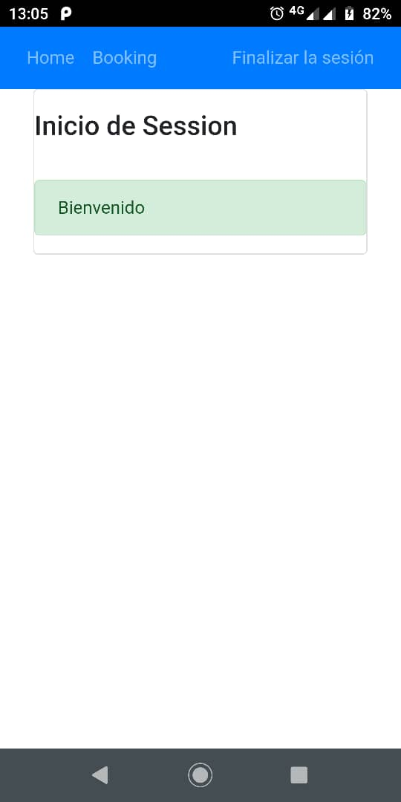

# booking app

app for show bookings

## Tópicos
*  **[📝 Requerimientos / tecnologias](#-requerimientos)**
*  **[🚀 Solucion](#-Solucion)**
*  **[🗂 Estructura de Directorios](#-estructura-de-directorios)**
*  **[👓 Pruebas](#-pruebas)**

## 📝 Requerimientos / Tecnologias
```
Nodejs 14.16.0
Angular 11.2.4
Ionic 5.4.16
Cordova 10.0.0
```
## 🚀 Solucion

Utilizando como base el proyecto booking-web en donde se utiliza Angular se integro con Ionic y Apache cordova para generar app hibridas partiendo del proyecto base

## 🗂 Estructura de Directorios
```
📦 resume-api 
│
│  
└─📁 src                  Código fuente
│ │
│ └─📁 app               componentes, módulos, servicios, utils
│ │
│ └─📁 assets            archivos
│ │       
│ └─📁 environments      Configuracion de ambientes
│
└─📄 README.md            Documentacion del software
```

## 👓 Pruebas
### Ejecutar
1. Para Ejecutar el proyecto se debe clonar, luego de clonar se deben de descargar las dependencias, y luego iniciar o generar ejecutables
>comandos:
```
git clone git@github.com:wrumbos/booking-app.git
cd booking-web
npm install
ionic cordova build android (para generar apk)
ionic cordova run android (Para correr en un navegador)
```
### Home pagina simple que contiene un titulo

### inicio de session pagina contiene un formulario para inciar session contempla validaciones


### booking al lograr un inicio de session exitoso a los usuarios puede consultar los bookings en donde se tendra una lista con las posibilidades de los campos id y precio filtar y ordenar

